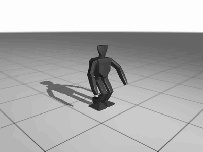

# strix-halo-jax

[](https://github.com/YauhenBichel/strix-halo-jax/actions/workflows/tests.yml)
[](LICENSE)
-ed1c24)

Run **JAX** and **MuJoCo MJX** (robotics simulation, e.g. MuJoCo Playground) on the GPU of an
**AMD Ryzen AI MAX** ("Strix Halo", Ryzen AI MAX+ 395, Radeon 8060S, `gfx1151`) from pip wheels —
**no system ROCm install** — and `jaxcheck`, a hang-safe check that tells you which wheel set works
on your machine: GPU devices, matmul, scatters, MJX reset and step, each in its own process.

Useful if you searched for *"Backend 'rocm' is not in the list of known backends"*, *JAX ROCm
gfx1151*, *MJX on AMD*, *HSA_STATUS_ERROR_MEMORY_APERTURE_VIOLATION* or *Strix Halo machine
learning*.

## Demo

`jaxcheck` on a Ryzen AI MAX+ 395 with the recipe below — every stage passes, including the
MuJoCo MJX ones ([evidence](docs/evidence-2026-09-11.md)):

```console
$ jaxcheck --label "jax-0.11.1 PyPI plugin + rocm[libraries] 7.13.0, no env vars"
jax-0.11.1 PyPI plugin + rocm[libraries] 7.13.0, no env vars devices       ok           3.0s
jax-0.11.1 PyPI plugin + rocm[libraries] 7.13.0, no env vars matmul        ok          15.0s
jax-0.11.1 PyPI plugin + rocm[libraries] 7.13.0, no env vars scatter_set   ok           3.5s
jax-0.11.1 PyPI plugin + rocm[libraries] 7.13.0, no env vars scatter_add   ok           4.0s
jax-0.11.1 PyPI plugin + rocm[libraries] 7.13.0, no env vars scatter_2d    ok           4.0s
jax-0.11.1 PyPI plugin + rocm[libraries] 7.13.0, no env vars scatter_vmap  ok           4.0s
jax-0.11.1 PyPI plugin + rocm[libraries] 7.13.0, no env vars scatter_oob   ok           4.0s
jax-0.11.1 PyPI plugin + rocm[libraries] 7.13.0, no env vars mjx_reset     ok          49.1s
jax-0.11.1 PyPI plugin + rocm[libraries] 7.13.0, no env vars mjx_step      ok         101.6s
```

A broken set shows up in seconds as `fault` or `fail`, instead of a process that hangs for half an
hour. What it is for — a humanoid walking policy trained on this machine with MuJoCo Playground
([humanoid-companion](https://github.com/YauhenBichel/humanoid-companion)):



That policy was trained on the CPU (103 M steps in 96 min, 16 JAX CPU devices) while the GPU path
was broken; with this recipe the same environment steps at up to 30,787 steps/s on the GPU
(table below).

## The working recipe (11 September 2026)

Linux x86_64, Python 3.12, [uv](https://docs.astral.sh/uv/):

```bash
uv venv -p 3.12 && source .venv/bin/activate
uv pip install --index https://repo.amd.com/rocm/whl/gfx1151/ --index-strategy unsafe-best-match \
  "jax==0.11.1" "jaxlib==0.11.1" "jax-rocm7-plugin==0.11.1" "jax-rocm7-pjrt==0.11.1" "rocm[libraries]==7.13.0"
python -c "import jax; print(jax.devices())"        # [RocmDevice(id=0)]
```

or, locked, from a clone: `uv sync --extra gfx1151 --extra mjx`. Your user must be in the `render` group
(`/dev/kfd` is `root:render 0660`): `sudo usermod -aG render,video $USER`, then log in again.

That is all: the 0.11.1 plugin (from **PyPI**) finds AMD's `rocm-sdk` library wheels by itself. No
`LD_LIBRARY_PATH`, no `HSA_OVERRIDE_GFX_VERSION`.

If the GPU is shared (with a local LLM, say), set `XLA_PYTHON_CLIENT_PREALLOCATE=false`, or JAX takes
75 % of device memory at start-up.

## Compatibility matrix

Each cell from `python jaxcheck.py --label …` ([evidence](docs/evidence-2026-09-11.md)) on a Ryzen AI MAX+ 395 (64 GiB BIOS carve-out as VRAM),
Ubuntu 24.04, kernel 7.0, no system ROCm. MJX stages: `mujoco_playground` 0.2.0 `Op3Joystick`,
`impl="jax"`, 16 environments.

| Wheel set | devices | matmul | scatters | MJX reset | MJX step |
|---|---|---|---|---|---|
| **JAX 0.11.1**: plugin + PJRT 0.11.1 from PyPI, `rocm[libraries]==7.13.0` (AMD gfx1151 index), no env vars | ok | ok | ok | **ok** | **ok** |
| JAX 0.9.2: TheRock nightly `0.9.2+rocm7.14.0a20260608` + `rocm[libraries]` of the same date, with `rocm-run` | ok | ok | ok | **fault**, then the process hangs | not reached |
| JAX 0.9.1: AMD gfx1151 release index `0.9.1+rocm7.13.0` + `rocm[libraries,devel]==7.13.0` | plugin cannot load: `librocm_sysdeps_hwloc.so.5`, `librocm_sysdeps_pciaccess.so.0` not in any 7.13.0 SDK wheel ([TheRock#8163](https://github.com/ROCm/TheRock/issues/8163)) | – | – | – | – |

The 0.9.x fault (`HSA_STATUS_ERROR_MEMORY_APERTURE_VIOLATION` in `input_scatter_fusion_5`, a large fused
scatter built from MJX kinematics) matches the fused-kernel bug fixed in XLA for JAX ≥ 0.10.0
([rocm-jax#453](https://github.com/ROCm/rocm-jax/issues/453)); no XLA flag avoided it on 0.9.2. Details:
[rocm-jax#132](https://github.com/ROCm/rocm-jax/issues/132#issuecomment-5637478637).

**Please add your row** (another kernel, a system ROCm install, a newer index): [CONTRIBUTING.md](CONTRIBUTING.md).

## MJX throughput on this chip

Raw `vmap(env.step)` of `Op3Joystick`, 100 steps after compile, JAX 0.11.1, GPU shared with a resident
52 GB LLM:

| environments | GPU (env steps/s) | one CPU device (env steps/s) |
|---|---|---|
| 1,024 | 7,744 | 4,780 |
| 4,096 | 28,612 | 6,376 |
| 8,192 | 30,787 | 3,605 |

For comparison, Brax PPO training of the same env on the CPU split into 16 JAX devices
(`--xla_force_host_platform_device_count=16`) ran at 21,600 steps/s including the learning updates — so
on this APU the GPU is a solid but not dramatic gain, and it competes with other GPU users for memory.
First compiles take 40–170 s per batch shape; a persistent compilation cache helps.

## `jaxcheck`: which set works, without hanging

Run it inside the environment you want to test (it checks the JAX that is installed there):

```bash
pip install strix-halo-jax     # jaxcheck only (standard library): it tests the JAX already installed
jaxcheck --label "my set"                                   # devices, matmul, scatters, MJX reset/step
jaxcheck --label "my set" --stages matmul scatter_set
XLA_FLAGS=--xla_… jaxcheck --label "with a flag"
```

or, with nothing installed yet, the tested set and the check in one go (verified with the wheel on the machine above):

```bash
uvx --python 3.12 --index https://repo.amd.com/rocm/whl/gfx1151/ --index-strategy unsafe-best-match \
    --from "strix-halo-jax[gfx1151,mjx]" jaxcheck --label "strix-halo-jax 0.1.0 set"
```

From a clone, `python jaxcheck.py …` works the same.

Each stage runs in its own process with its output streamed to `results/<label>-<stage>.log`, and is
recorded as **ok**, **fail** (non-zero exit; last error line kept), **fault** (a GPU fault signature was
printed — the process is killed at once, because after a queue abort ROCm processes can hang instead of
exiting) or **timeout**. Results go to `results/results.jsonl` and a table in `results/README.md`.
The MJX stages need `pip install playground`.

## Traps we hit (so you don't)

| Symptom | Cause | Fix |
|---|---|---|
| `Backend 'rocm' is not in the list of known backends`, `rocm_plugin_extension not found` | a 0.9.x plugin cannot find the ROCm libraries (no system ROCm) | use the 0.11.1 plugin from PyPI; for 0.9.x, `./rocm-run` sets the paths |
| `FAILED_PRECONDITION: No visible GPU devices`; `rocminfo`: *not member of "render" group* | `/dev/kfd` permission | `sudo usermod -aG render,video $USER`, log in again |
| a benchmark "compiles" for 25 minutes, one thread at 100 % | a GPU fault followed by a hang (0.9.x + MJX), not a compile | upgrade to JAX ≥ 0.10; use `jaxcheck.py` to see `fault` in seconds |
| `rocblas_gemm_ex failed with: rocblas_status_internal_error` in code that used to work | a persistent compilation cache shared between JAX versions ("PjRt-IFRT does not track XLA executable versions") | one cache per jaxlib/plugin build (`rocm-run` does this) |
| `Unknown flag in XLA_FLAGS: --xla_gpu_…` | the flag exists in the plugin's strings but jaxlib does not accept it | drop it; `jaxcheck.py` reports the line |
| out-of-memory next to a local LLM | the BIOS gives the iGPU a fixed carve-out (64 GiB here) shared by everything on the GPU | preallocation off; or set the BIOS UMA frame buffer to its minimum so the GPU uses GTT from the full RAM |

## Contributors

<!-- readme: contributors,bots/- -start -->
<!-- readme: contributors,bots/- -end -->

## Licence and disclaimer

Apache-2.0. Measurements from one machine on one day; your firmware, kernel and wheel versions may
differ — the matrix says exactly what was tested. Not affiliated with AMD or Google DeepMind. A
developer tool, provided as is; not a medical device and not for clinical use.
